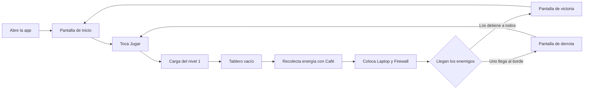

# Ficha de idea

## 1. Nombre
Defensa ESCOM

## 2. Ruta elegida y motivo
**Ruta:** Juego móvil nativo.

**Motivo:** Un juego de defensa por carriles permite practicar los temas de la materia (UI, estados, bucle de juego, persistencia local, animaciones) con reglas fáciles de explicar. El tema del IPN/ESCOM lo vuelve cercano para quien lo juegue.

## 3. Usuario y contexto
- **Quién:** estudiante de ESCOM o del IPN, de 18 a 24 años, con celular Android.
- **Dónde:** pasillos, cafetería o transporte.
- **Cuándo:** en descansos de 10 a 15 minutos entre clases o durante traslados.

## 4. Problema observable (una frase)
Los estudiantes llenan sus descansos cortos con juegos genéricos que no tienen nada que ver con su vida en la escuela y que requieren partidas largas.

## 5. Alternativa actual
Juegos de defensa existentes (por ejemplo, de estrategia por carriles) y redes sociales. Ninguno usa el contexto del IPN/ESCOM y varios exigen partidas largas, registro o conexión.

## 6. Tarea principal del usuario
Colocar defensores en un tablero de 5 carriles para frenar una oleada de enemigos antes de que lleguen al lado izquierdo.

## 7. Criterio de éxito
Una persona que nunca ha visto el juego completa el nivel 1 en menos de 5 minutos, sin ayuda externa.

## 8. Alcance de la primera versión (entra)
- 1 nivel con tablero de 5 carriles x 9 columnas.
- 3 defensores:
  - **Café:** genera energía (el recurso del juego).
  - **Laptop:** dispara código a los enemigos de su carril.
  - **Firewall:** bloquea y resiste el avance.
- 3 enemigos: arquetipos caricaturescos de profesores, sin nombres ni parecido a personas reales:
  - **El de la tarea infinita:** enemigo básico.
  - **El del examen sorpresa:** enemigo rápido.
  - **El de las 200 diapositivas:** enemigo resistente.
- Pantallas: inicio, juego, victoria, derrota y pausa.
- Guardado local del progreso.

## 9. Funciones aplazadas
- Más de un nivel.
- Multijugador y tabla de posiciones en línea.
- Tienda o compras dentro de la app.
- Inicio de sesión.
- Jefe final ("El examen final") y más arquetipos de profesores.
- Música y efectos de sonido avanzados.

## 10. Estados que no son la ruta feliz
- **Carga:** pantalla de carga al iniciar el nivel.
- **Lista vacía:** tablero sin defensores colocados al inicio, con una pista visual.
- **Error:** fallo al leer o guardar el progreso, con mensaje y opción de reintentar.
- **Datos inválidos:** intentar colocar un defensor en una casilla ocupada o sin energía suficiente, con aviso visual.

## 11. Recorrido del usuario

## 12. Historia de usuario
Como estudiante de ESCOM, quiero sobrevivir a una oleada de profesores caricaturescos colocando defensores en un tablero, para divertirme en un descanso corto.

**Criterio de aceptación:**
Dado que el tablero del nivel 1 está vacío y tengo energía suficiente, cuando toco un defensor y luego una casilla libre, entonces el defensor aparece en esa casilla y mi energía disminuye según su costo.

## 13. Evidencia
**Estado: hipótesis sin validar.**
Hipótesis: los estudiantes de ESCOM jugarían un juego con temática de su escuela en descansos cortos.
Esta idea se trabajó solo dentro del equipo, sin pruebas con usuarios externos, por lo que se declara como hipótesis sin validar.

